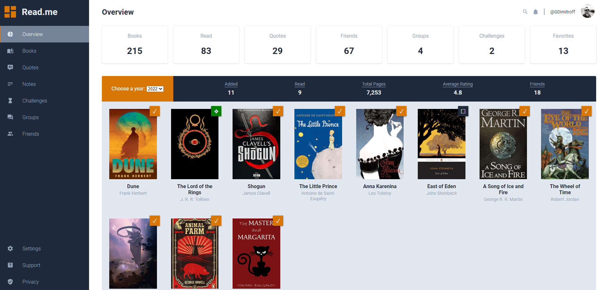

### Project: [Admin Dashboard](https://gdimitroff.github.io/admin-dashboard/)

Admin Dashboard is the second project for the FullStack JavaScript module on The Odin Project. This mock admin dashboard was built as a way to showcase the CSS grid knowledge that has been taught so far in this course. The webpage is fully responsive, becoming a single column of content for mobile viewing.

### Features

- Fully **responsive** design
- Implemented **hamburger menu** with JavaScript

### Outcome

- Used **HTML5 semantic elements** for better structure and readability
- Heavily used **CSS Grid** to create layout
- Used more complex **CSS Selectors**
- Strived to make the **UI** and **UX** as friendly as possible

